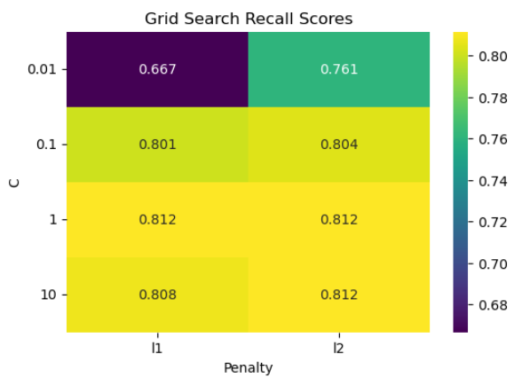

# 🕵️‍♂️ Fraud Detection Model


This project uses machine learning to detect fraud in a labeled dataset. It covers data preprocessing, model training, evaluation, and visualization of fraud prediction.

---

## 📂 Project Structure

```
Fraud-Detection-Model/
├── data/
│   └── fraud_data.csv              # Dataset (CSV file)
├── images/
│   └── gridsearch_heatmap.png     # Heatmap of hyperparameter tuning
├── notebooks/
│   └── fraud_assignment.ipynb     # Jupyter notebook (main assignment)
├── fraud_assignment.py            # Converted Python script version
├── requirements.txt               # Project dependencies
├── README.md                      # Project overview (this file)
└── LICENSE                        # MIT License
```

## 📊 Dataset

The dataset (`fraud_data.csv`) contains observations labeled as fraudulent or not. The goal is to predict fraud using classification models.

---

## 🌟 Features

- Load and explore the dataset
- Train/test split
- Use of `DummyClassifier` as baseline
- Train classifiers like:
  - Logistic Regression
  - Support Vector Machines
  - Decision Trees
- Evaluate using:
  - Accuracy
  - Recall
  - Precision
  - Confusion Matrix
- Visualization using seaborn/matplotlib
- GridSearchCV for hyperparameter tuning

---

## 🛠️ Installation

Install dependencies:

```bash
pip install -r requirements.txt
```

Run the notebook:

```bash
jupyter notebook notebooks/fraud_assignment.ipynb
```

Or run the Python script in PyCharm or terminal:

```bash
python fraud_assignment.py
```

---

## 📊 Sample Visuals

### 🔥 Grid Search Heatmap


---

## 📌 Requirements

```
- Python 3.7+
- scikit-learn
- pandas
- numpy
- matplotlib
- seaborn
```

---
## 📄 License

This project is licensed under the [MIT License](LICENSE).
